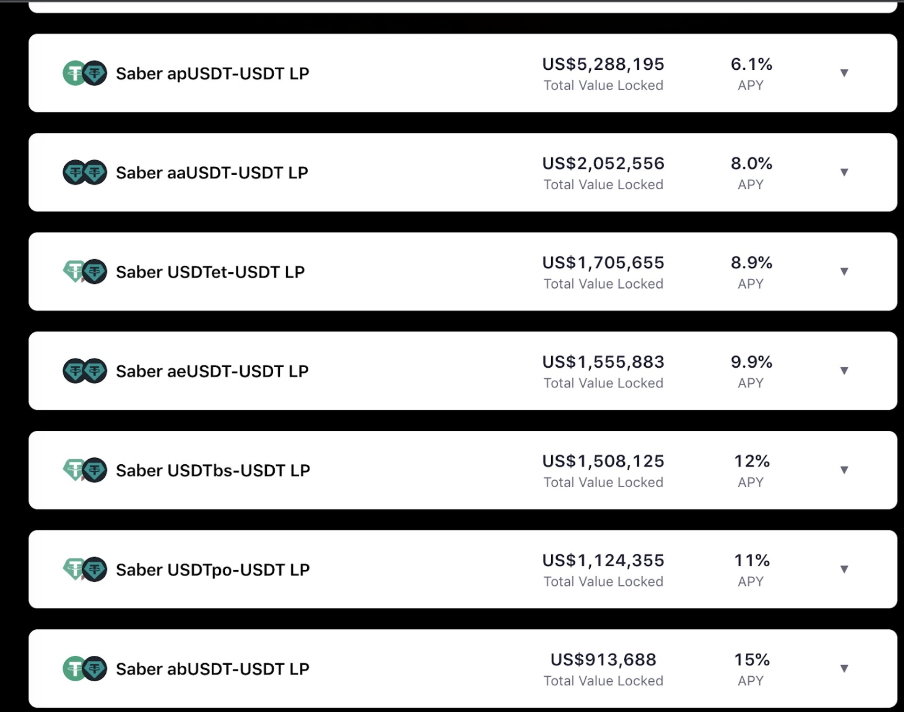

# Background

As with all technologies, Abacus has been influenced and inspired by those that came before it.

In this page we describe previous approaches to interoperability and propose **"Interchain Applications"** as a vision for the future of the decentralized web.

### Eras of Interoperability


Work on blockchain interoperability dates back to the [early days](https://bitcointalk.org/index.php?topic=91843.msg1011956#msg1011956) of Bitcoin. Abacus focuses specifically on interoperability of smart contract platforms. &#x20;


#### _2016-2019: Walled gardens_

The first era of interoperability focused on communication between blockchains built within the same ecosystem.

In these days, smart contract platforms were still nascent. Ethereum had launched the year before, and the notion of a winner-take-all market was common. In that context it's easy to see why interoperability designs of the time, such as [Cosmos and IBC](https://docs.cosmos.network/master/ibc/overview.html), and [Polkadot parachains](https://wiki.polkadot.network/docs/learn-parachains), focused on solving **intra**-ecosystem communication. These designs offered native interoperability for blockchains that adopted an ecosystem-wide standard consensus protocol .

IBC is the intellectual wellspring that informs the Abacus design philosophy. While IBC is the most secure and effective way to achieve **intra-**ecosystem interoperability, it does not allow for communication across between non-Cosmos-SDK chains, which is required in the heterogenous multi-chain world that has since developed.\
\
The emergence of a multi-chain world gave way to the next era of interoperability, token bridges.

#### _2020-2022: The bridges are coming!_

The second era of interoperability centered around transfer of assets between chains.

The emergence of multiple viable smart contract platforms created a need for a form of inter-ecosystem interoperability.  The DeFi Summer of 2020 highlighted the value of composability, but at the time composability was limited to a single chain.

Enter token bridges.

Token bridges allow users to move tokens (token derivatives, technically), from one chain to another, and enable a level of composability between applications on different chains.

While there are many ways to build a token bridge, most bridges require users to lock their tokens in a smart contract on the source chain and mint "IOU" tokens on the destination chain in return. This results in every bridge having its own representation of a particular token on a particular chain, which can complicate the user experience and fragment liquidity.

Increased competition between token bridges has only exacerbated this problem.

While many token bridges are built top of generic message passing protocols, Abacus focuses primarily on the concept of interchain applications, which we believe will define the next era of interoperability.
